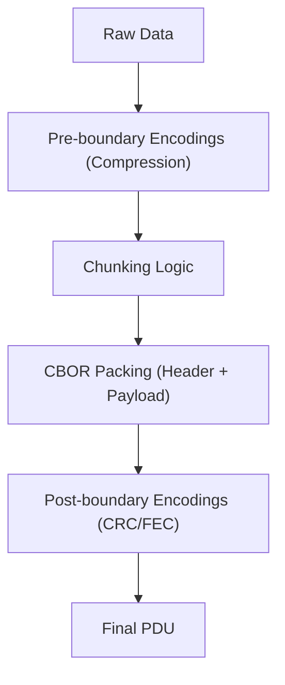

# Project Overview
`py-hqfbp` is the Python implementation of the Hamradio Quick File Broadcasting Protocol (HQFBP). It 
provides a robust, low-overhead mechanism for broadcasting files and data over ham radio links, 
specifically optimized for high-latency or one-way satellite downlinks using CBOR-indexed headers 
and flexible chunking.

## Repository Structure
- `src/hqfbp/` – Core package containing the protocol implementation.
    - `__init__.py` – Primary API with `pack`, `unpack`, and protocol constants (RFC Section 4).
    - `generator.py` – `PDUGenerator` class for automated chunking, compression, and PDU sequences.
    - `py.typed` – PEP 561 marker indicating the package provides type hints.
- `tests/` – Test suite ensuring RFC compliance and logic correctness.
    - `test_hqfbp.py` – Tests for basic packing/unpacking and header merging.
    - `test_generator.py` – Tests for the `PDUGenerator` and chunking logic.
- `pyproject.toml` – Project metadata, dependencies (`cbor2`, `brotli`), and build system (`uv`).
- `uv.lock` – Deterministic dependency lock file.
- `LICENSE` – MIT License file.

## Build & Development Commands
```bash
# Install dependencies and setup environment
uv sync

# Run all tests
uv run pytest

# Run tests with coverage (optional, requires pytest-cov)
uv run pytest --cov=hqfbp

# Format and lint (Ruff recommended)
uv run ruff format .
uv run ruff check .
```

## Code Style & Conventions
- **Python Version**: 3.12+ (utilizing modern type hinting and f-strings).
- **Formatting**: PEP 8 compliant; 4-space indentation.
- **Naming Patterns**: `snake_case` for functions/variables, `PascalCase` for classes, `UPPER_SNAKE` 
  for protocol constants.
- **CBOR Optimization**: Headers must be optimized using `HQFBP_CBOR_KEYS`.
- **Commit Messages**: Prefer conventional commits (e.g., `feat:`, `fix:`, `docs:`).

## Architecture Notes
The system follows a layered approach for PDU preparation:
1. **Pre-boundary Encodings**: Compression (gzip, br, lzma) applied to the whole data.
2. **Chunking**: Data split into chunks according to `max_payload_size`.
3. **Packing**: Each chunk wrapped in a CBOR header using `pack`.
4. **Post-boundary Encodings**: FEC or CRC applied to the resulting PDU.



## Testing Strategy
- **Unit Tests**: Focus on `pack`/`unpack` correctness and header optimization.
- **Integration Tests**: `PDUGenerator` testing the full flow from raw data to multiple PDUs.
- **Verification**: Tests compare output against RFC examples to ensure interoperability.

## Security & Compliance
- **Input Validation**: `unpack` uses `cbor2.loads`. Treat incoming radio data as untrusted.
- **Dependency Scanning**: Periodic audits of `cbor2` and `brotli` for vulnerabilities.
- **License**: MIT License.

## Agent Guardrails
- **RFC Alignment**: Do NOT modify `HQFBP_CBOR_KEYS` in `__init__.py` without RFC updates.
- **Byte Optimization**: Always prioritize small PDU headers; avoid redundant textual keys.
- **Review Requirement**: Changes to the encoding sequence in `PDUGenerator` require manual review.

## Extensibility Hooks
- **Encoding Registry**: Add new encoding types to `ENCODING_REGISTRY` in `__init__.py`.
- **Custom Headers**: `pack` accepts additional keys; use integers for efficiency where possible.

## Further Reading
- [README.md](README.md)
- [HQFBP RFC](https://github.com/loic-fejoz/hqfbp/blob/main/rfc.md) (local version @[../hqfbp/rfc.md])
